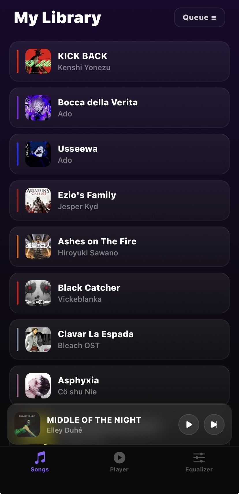
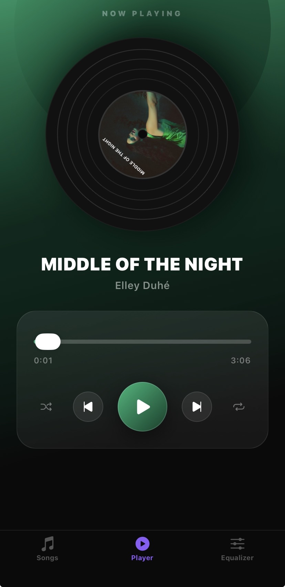
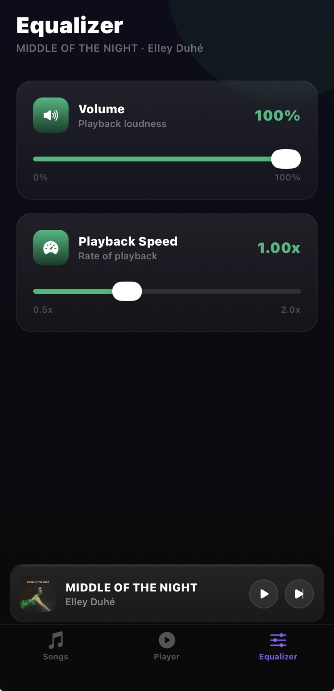

# 🎵 Music Player

A fully-featured mobile music player built with **React Native** and **Expo SDK 54**, featuring a glassmorphism UI, dynamic per-song color theming, spinning vinyl artwork, and a persistent mini player.

---

## 📱 Screenshots

> Player Screen · Songs Library · Equalizer





---

## ✨ Features

- 🎵 **29 bundled songs** with matched album artwork
- ▶️ **Play / Pause / Skip** with proper autoplay
- 🔀 **Shuffle** using Fisher-Yates algorithm
- 🔂 **Repeat** current song
- 🎚️ **Volume & Playback Speed** controls (Equalizer screen)
- 💿 **Spinning vinyl** with album art that pauses and resumes from the exact position
- 🎨 **Dynamic color theming** — background gradient changes per song
- 🪟 **Glassmorphism UI** with `expo-blur` frosted glass cards throughout
- 📋 **Queue modal** — bottom sheet showing all songs, tap to jump
- 🎛️ **Mini player** — persists above the tab bar on all screens except Player, fades in/out smoothly

---

## 🗂️ Project Structure

```
MusicPlayer/
├── assets/
│   ├── songs/          ← 29 bundled MP3 files
│   └── artwork/        ← 29 album artwork images (jpg/png)
├── components/
│   └── MiniPlayer.js   ← Persistent mini player bar above tab bar
├── constants/
│   └── songs.js        ← Song metadata: title, artist, file, artwork, color
├── context/
│   ├── MusicContext.js ← All audio logic, playback state, shuffle/repeat
│   └── ThemeContext.js ← Global design tokens (colors, glass styles, typography)
├── screens/
│   ├── SongsScreen.js  ← Song library + queue modal
│   ├── PlayerScreen.js ← Full player with vinyl, controls, progress
│   └── SettingsScreen.js ← Equalizer (volume + playback speed)
└── App.js              ← Navigation setup + provider tree
```

---

## 🧱 Architecture

### Provider Tree

```
ThemeProvider
  └── MusicProvider
        └── NavigationContainer
              └── TabNavigator
                    └── MiniPlayer (global, above tab bar)
```

`ThemeProvider` wraps everything so design tokens are available everywhere. `MusicProvider` wraps navigation so all screens share one audio instance. `MiniPlayer` lives inside `TabNavigator` but outside the screens, making it truly global.

---

### MusicContext — The Brain

All audio logic lives in `MusicContext.js`. No screen manages its own audio.

**State exposed:**

| Name           | Type     | Purpose                                       |
| -------------- | -------- | --------------------------------------------- |
| `currentIndex` | number   | Index of the currently playing song           |
| `isPlaying`    | boolean  | Whether audio is actively playing             |
| `position`     | number   | Current playback position in ms               |
| `duration`     | number   | Total song duration in ms                     |
| `volume`       | number   | 0.0 – 1.0                                     |
| `pitch`        | number   | 0.5x – 2.0x playback rate                     |
| `isShuffled`   | boolean  | Shuffle mode on/off                           |
| `isRepeating`  | boolean  | Repeat current song on/off                    |
| `currentColor` | string[] | `[primaryColor, darkColor]` from current song |

**Audio flow:**

1. `currentIndex` changes → `useEffect([currentIndex])` fires → `loadAndPlay(index)`
2. `loadAndPlay` unloads the previous sound, then calls `Audio.Sound.createAsync()` with `{ shouldPlay: true }` so it autoplays immediately on load
3. `onPlaybackStatusUpdate` runs every ~500ms: syncs position/duration/isPlaying, and handles `didJustFinish` to advance to the next song or replay if repeat is on
4. `skipNext` / `skipPrev` call `setCurrentIndex` which triggers step 1 again

**Why `expo-av` and not `expo-audio`?**

We started with `expo-audio` (the newer library) but hit a confirmed Android bug — `player.replace()` was broken ([GitHub issue #35670](https://github.com/expo/expo/issues/35670)) and `useAudioPlaylist` wasn't available in SDK 54. We switched to `expo-av`'s `Audio.Sound.createAsync()` which is stable, well-documented, and handles autoplay reliably across platforms.

---

### ThemeContext — Design System

A static context that provides shared design tokens to every screen. No state, just a plain object.

```javascript
theme.colors; // background, surface, text, textSecondary, textMuted
theme.glass; // reusable glassmorphism card style
theme.typography; // heading, title, body, caption
theme.spacing; // xs, sm, md, lg, xl
theme.radius; // sm, md, lg, full
```

Screens import `useTheme()` for consistent styling. The Player screen overrides colors dynamically using `currentColor` from `MusicContext`.

---

### Song Metadata (`constants/songs.js`)

Each song entry has:

```javascript
{
  id: "1",
  title: "KICK BACK",
  artist: "Kenshi Yonezu",
  file: require("../assets/songs/filename.mp3"),
  artwork: require("../assets/artwork/filename.jpg"),
  color: ["#E8251A", "#5C0A08"],  // [light, dark] for gradient
}
```

Colors are hardcoded per song because dynamic color extraction (`react-native-image-colors`) requires a native dev build which isn't compatible with Expo Go. Colors were manually chosen to match each song's artwork.

---

## 🐛 Bugs We Fixed & Why

### 1. Race condition on fast skip

**Problem:** Tapping skip quickly would cause multiple `loadAndPlay` calls to fire simultaneously. They'd all resolve at different times, leaving ghost sounds playing in the background even after moving to a new song.

**Fix:** A cancellation token pattern — each `loadAndPlay` call creates a unique object reference (`thisLoad = {}`). Before committing a loaded sound, it checks `loadingRef.current !== thisLoad`. If another load started after it, the resolved sound is immediately unloaded and the function returns early. Only the most recently initiated load ever commits.

```javascript
const loadAndPlay = async (index) => {
  loadingRef.current = false;
  const thisLoad = {};
  loadingRef.current = thisLoad;

  await unload();

  if (loadingRef.current !== thisLoad) return; // stale, bail

  const { sound } = await Audio.Sound.createAsync(...);

  if (loadingRef.current !== thisLoad) {
    await sound.unloadAsync(); // ghost sound, kill it
    return;
  }

  soundRef.current = sound;
};
```

---

### 2. White/black screen flash on tab switch

**Problem:** Using `animation: "fade"` on tab transitions caused a flash to white or black as the screen faded out to transparent before the next screen faded in.

**Fix:** Remove `animation: "fade"` entirely from `screenOptions`. React Navigation's default instant switch is cleaner and has no flash.

---

### 3. Stale closure in `onPlaybackStatusUpdate`

**Problem:** `onPlaybackStatusUpdate` is passed to `Audio.Sound.createAsync` once and never updated. Any variables it closes over (`isRepeating`, `getNextIndex`) become stale after state changes — so repeat and shuffle wouldn't work correctly after being toggled.

**Fix:** Store both `isRepeating` and `getNextIndex` in refs, and keep them synced with `useEffect`:

```javascript
useEffect(() => {
  isRepeatingRef.current = isRepeating;
}, [isRepeating]);
useEffect(() => {
  getNextIndexRef.current = getNextIndex;
}, [getNextIndex]);
```

The callback always reads from the refs, guaranteeing it sees the latest values.

---

### 4. MiniPlayer visibility glitch

**Problem:** Using `if (activeRoute === "Player") return null` caused an abrupt unmount. When returning to another tab, the mini player would sometimes not reappear because the `Animated.Value` was left at 0.

**Fix:** Never unmount the mini player. Instead animate its `opacity` to 0/1 based on `activeRoute`, and use `pointerEvents="none"` when hidden so it can't be accidentally tapped on the Player tab.

---

### 5. `expo-audio` `player.replace()` broken on Android

**Problem:** The new `expo-audio` library's `player.replace()` method didn't work on Android (confirmed upstream bug). Switching songs would crash silently or not play the new track.

**Fix:** Migrated entirely to `expo-av` (`Audio.Sound.createAsync`). The older API is more verbose but fully stable across both platforms on SDK 54.

---

## 📦 Libraries Used

| Library                                                      | Why                                                                                |
| ------------------------------------------------------------ | ---------------------------------------------------------------------------------- |
| `expo-av`                                                    | Core audio playback engine. Stable on SDK 54, handles autoplay, seek, volume, rate |
| `expo-linear-gradient`                                       | Dynamic gradients for backgrounds and button accents                               |
| `expo-blur`                                                  | `BlurView` for frosted glass / glassmorphism card effects                          |
| `@react-native-community/slider`                             | Progress bar, volume, and playback speed sliders                                   |
| `@react-navigation/native` + `@react-navigation/bottom-tabs` | Tab-based navigation                                                               |
| `react-native-screens`                                       | Native screen optimization for navigation                                          |
| `react-native-safe-area-context`                             | Safe area inset handling                                                           |
| `@expo/vector-icons` (Ionicons)                              | Clean vector icons matching the glassmorphism aesthetic                            |

---

## 🚀 Getting Started

### Prerequisites

- Node.js 18+
- Expo Go app on your phone (SDK 54)

### Install

```bash
git clone https://github.com/moradhi/music-player.git
cd music-player
npm install
npx expo start
```

Scan the QR code with Expo Go.

> ⚠️ This project is locked to **Expo SDK 54** to maintain Expo Go compatibility. Do not run `expo upgrade` or install SDK 55+ packages.

---

## 🔮 Future Improvements

- **Lock screen metadata** — Show song title and artwork on the iOS/Android lock screen widget. Requires migrating to `react-native-track-player` (needs a dev build)
- **API-driven library** — Swap bundled songs for a free music API (e.g. Deezer preview API)
- **Dynamic color extraction** — Use `react-native-image-colors` to auto-extract colors from artwork (requires dev build)
- **Search** — Filter the song list by title or artist
- **Swipe gestures** — Swipe left/right on the Player screen to skip songs
- **Animated equalizer bars** — Visual now-playing indicator in the songs list

---

## 👤 Author

**Moradhi** — built as a React Native learning project.
